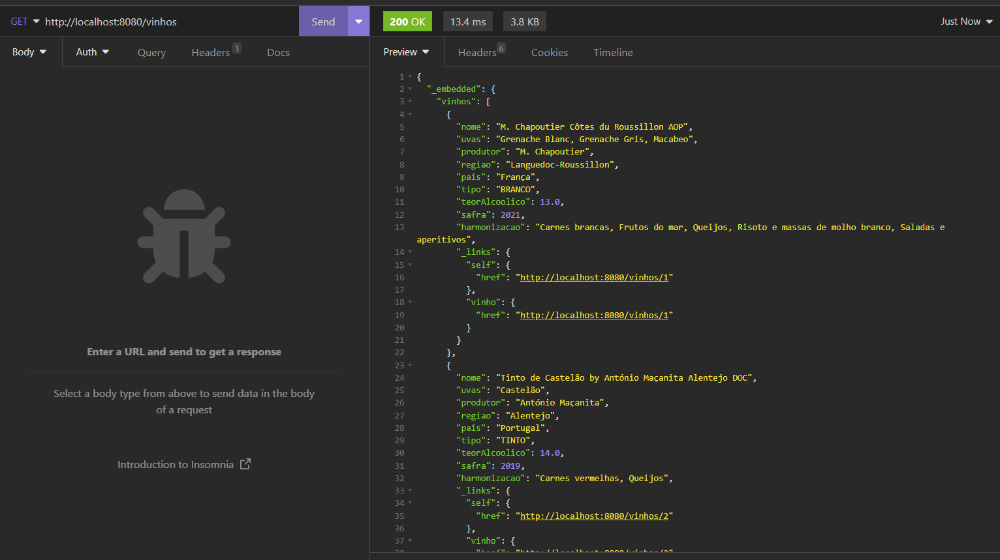
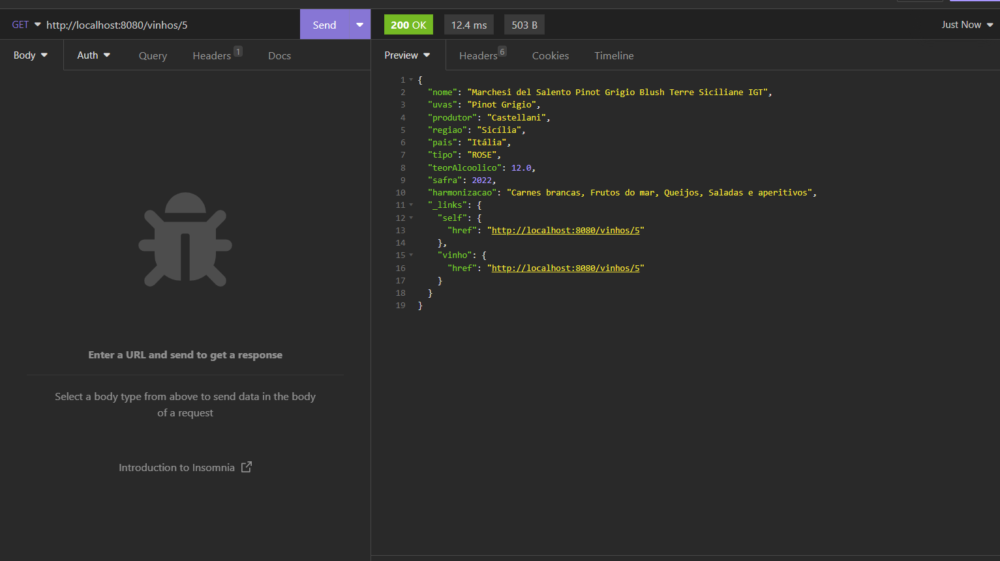
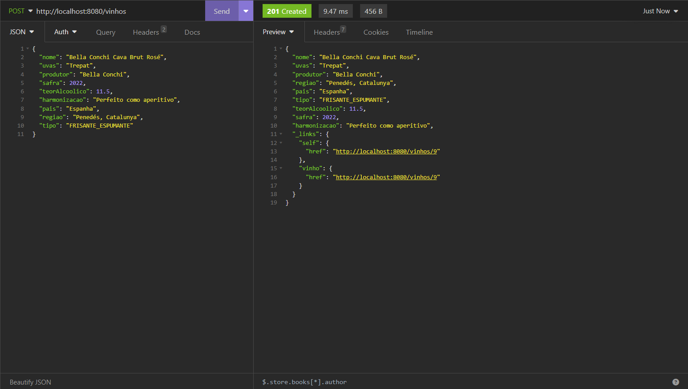
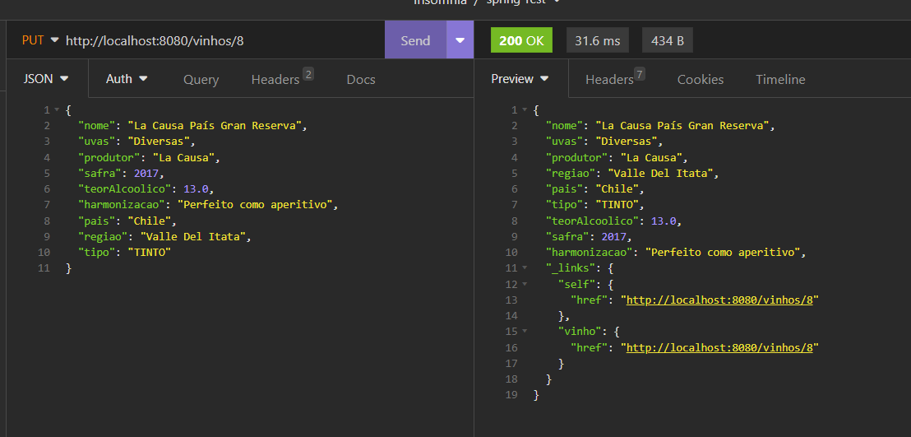
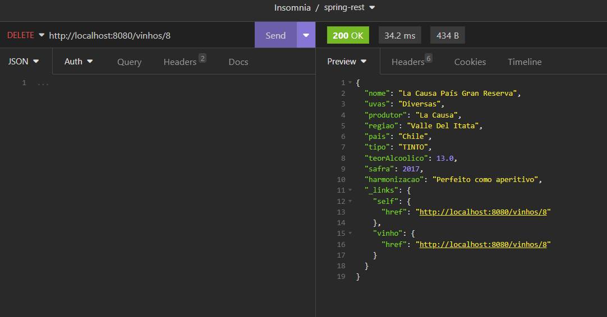
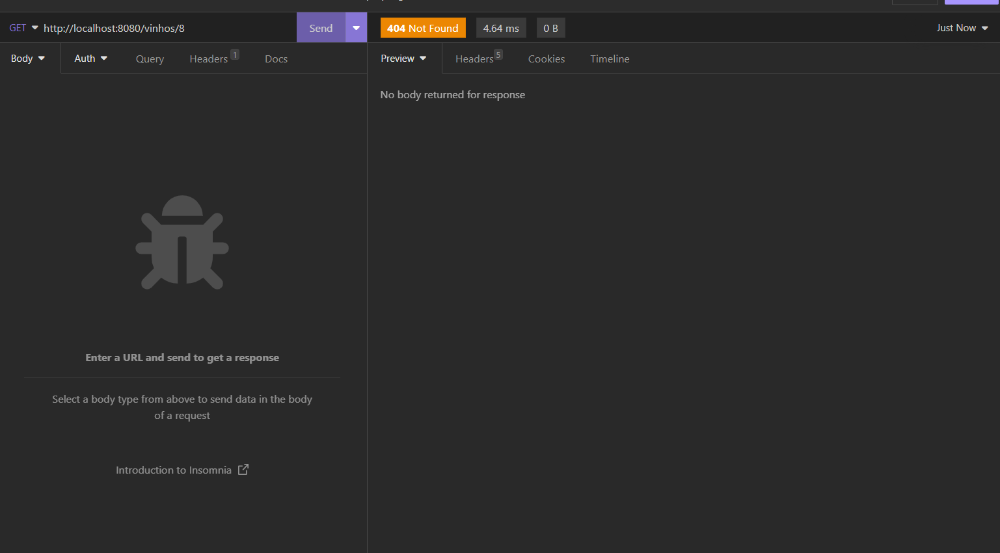
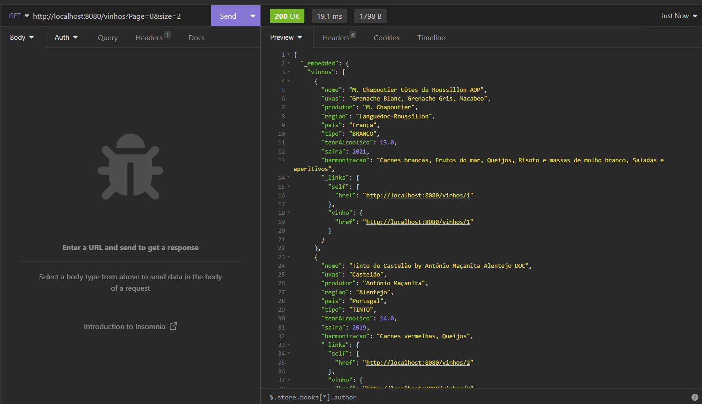
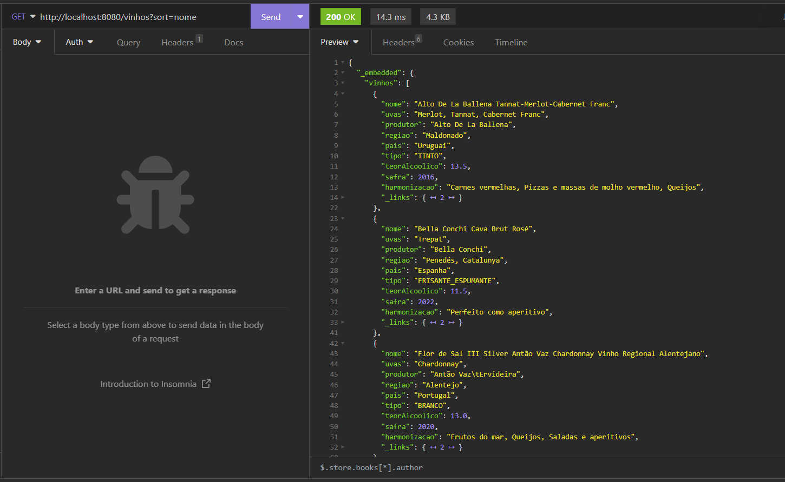
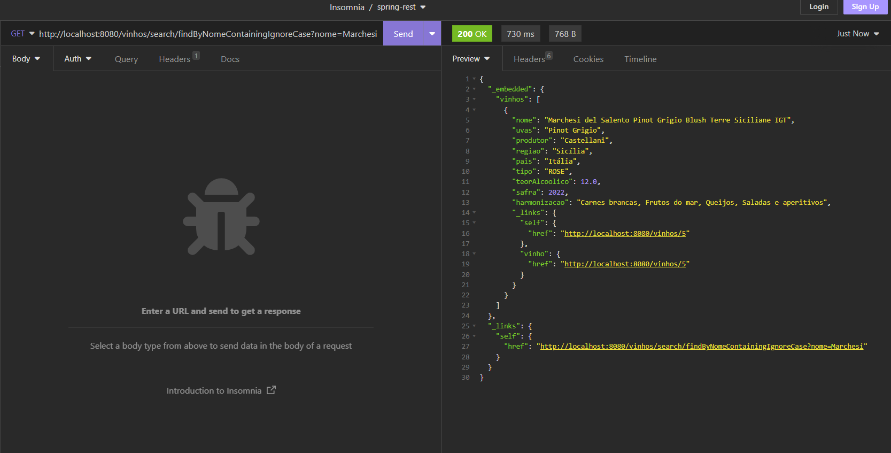

# Spring Data Rest

Neste projeto estou usando o Spring Data Rest, uma biblioteca que facilita a criação de uma API RESTful, pois ela cria automaticamente os endpoints para os recursos do projeto.

Com essa dependência eu só preciso criar a entidade e o repositório. A biblioteca já cria os endpoints para os recursos.

Exemplo de métodos CRUD testados nessa aplicação:

### FindAll

### FindById

### Create

### Update

### Delete

### Find All com paginação

### Find All com ordenação

### Find By Nome Containing IgnoreCase
